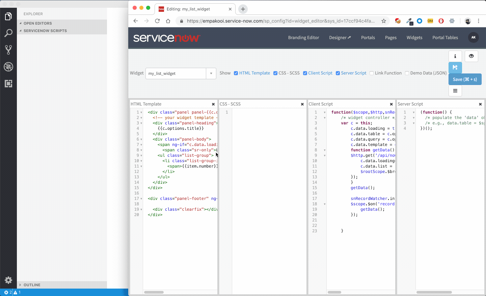
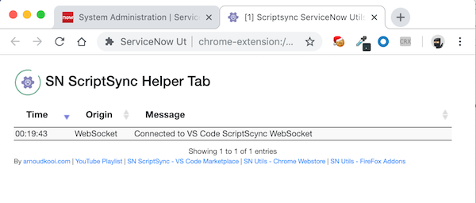
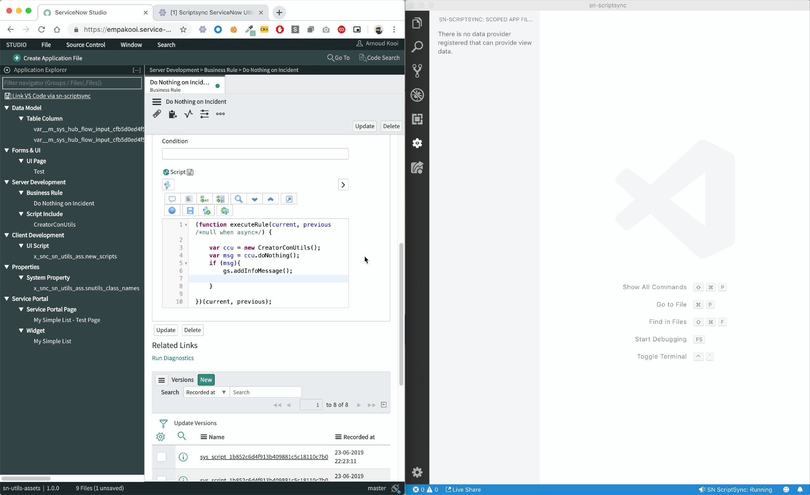

# VS Code ScriptSync for ServiceNow
Easy Integration from ServiceNow to VS Code to be able to script in a full fledged editor, without any configuration.

## [YouTube video demonstrating usage (2022 update)](https://www.youtube.com/watch?v=ZDDminMjGTA)

# SN Utils
Requires the latest version of SN Utils, links via: 
[arnoudkooi.com](https://arnoudkooi.com)  

**In case of issues, always check for the latest version of both the browser and VS Code extension, and update if needed!**

# Setup
After installing both this extension and the browser extension, open a folder in VS Code and enable scriptsync in VS Code.

## Setting folder
In the settings page you can enter a default file path.
When this folder is opened as workspace, the service is automatically started.
Default value for path: ~/Documents/sn-scriptsync

## Manual start/stop
The ScriptSync service can be manually started or stopped by clicking the Statusbar text in the bottom of the window.

## Enable in SN Utils
From the browser ScriptSync must be enabled once, by opening the popup and in the settings tab enable the checkbox 

# Usage
While using, be sure to keep the helper tab open. This will show logging and acts as a communication channel between ServiceNow and VS Code. This can be opened from the context menu.

## Forms
After activating, in forms for appropriate fields, such as script, css and html a small save button will display.

Clicking it will save the current field value direct to the filesystem and open it in VS Code.

In VS Code the structure for the file will be:
instance/table/fieldname^scriptname^sys_id.extension

Saving it in VS Code, will save it back to the instance.

## Widgets
The workflow for ServicePortal widgets is shown in the animated gif above. From the widget editor click on the save button.
This will create all the relevant fields as files on the filesystem, in a folder with the name of the widget.
In a subfolder the angular ng-templates will be placed.

Besides that a file test_urls.txt is created.
In this page you can add your own urls. When saving a file, ScriptSync will refresh the browser pages that match that URL, enabling live preview.

Widget SCSS can be live edited, each change can immediate be previewed in the browser. See animation below.

## Studio integration
In studio you can click Link VS Code via sn-scriptsync (requires version 3.3 or higher from SN Utils).
It will show you the tree of artefacts in your app and all the scriptable fields.
When clicking an field, it will be pulled from the server. If the file is already open, it will switch to that window.
This is an alterbative to clicking each individual button in the platform. SP widgets are not jet supported at this point.
Note this feature is in beta.

## Intellisense
Basic inteliisense is added to autocomplete the ServiceNow API's and functions.

## ESLint
I recommend installing ESLint and the [ESLint ServiceNow plugin](https://www.npmjs.com/package/eslint-plugin-servicenow).
This will do some basic code checks.

## FAQs

I'm using `<script>` tags in a widget HTML template, and they do not sync to my instance properly. How can I resolve this?

**Solution** (See [#24](https://github.com/arnoudkooi/sn-scriptsync/issues/24)): In your ServiceNow instance, set the following system property:
* **`glide.rest.sanitize_request_input`** = **`false`** 

I get an error when using in Safari: "User Not Authenticated"

**Solution** Disable "User Not Authenticated" in Safari Privacy settings

sn-scriptsync does not work in Brave browser

**Solution** Shield down your instance in Brave browser

## Issues
Please report an issue on GitHub if you experience problems, or have a feature request.

## Warranty
This tool cmes as is with no warranty.
Not allowed to copy or republish this extension

