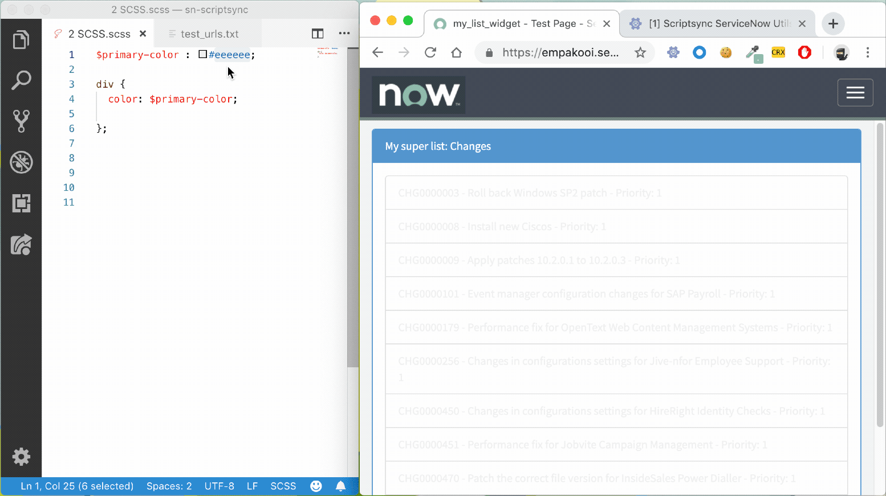

# ServiceNow VS Code ScriptSync
Easy Integration from ServiceNow to VS Code to be able to script in a full fledged editor, without any configuration.

## [YouTube video demonstrating usage](https://www.youtube.com/watch?v=vCQ-PtQYnGU)

# ServiceNow Utils
Requires the latest version of
[ServiceNow Utils for Chrome](https://chrome.google.com/webstore/detail/servicenow-utils/jgaodbdddndbaijmcljdbglhpdhnjobg) or 
[ServiceNow Utils Firefox](https://addons.mozilla.org/nl/firefox/addon/servicenow-utils2/) 

**In case of issues, always check for the latest version of both the browser and VS Code extension, and update if needed!**

# Setup
After installing both this extension and the browser extension, open a folder in VS Code and enable scriptsync in VS Code.

## Setting folder
In the settings page you can enter a default file path.
When this folder is opened as workspace, the service is automatically started.
Default value for path: ~/Documents/sn-scriptsync

## Manual start/stop
The ScriptSync service can be manually started or stopped by clicking the Statusbar text in the bottom of the window.

## Enable in ServiceNow Utils
From the browser ScriptSync must be enabled once, by opening the popup and in the settings tab enable the checkbox 

# Usage
While using, be sure to keep the helper tab open. This will show logging and acts as a communication channel between ServiceNow and VS Code. This can be opened from the context menu.

## Forms
After activating, in forms for appropriate fields, such as script, css and html a small save button will display.

Clicking it will save the current field value direct to the filesystem and open it in VS Code.

In VS Code the structure for the file will be:
instance/table/fieldname^scriptname^sys_id.extension

Saving it in VS Code, will save it back to the instance.

*Note the live preview is currently only supported in Chrome, not in FireFox*

## Widgets
The workflow for ServicePortal widgets is shown in the animated gif above. From the widget editor click on the save button.
This will create all the relevant fields as files on the filesystem, in a folder with the name of the widget.
In a subfolder the angular ng-templates will be placed.

Besides that a file test_urls.txt is created.
In this page you can add your own urls. When saving a file, ScriptSync will refresh the browser pages that match that URL, enabling live preview.

Widget SCSS can be live edited, each change can immediate be previewd in the browser. See animation below.

## ESLint
I recommend installing ESLint and the [ESLint ServiceNow plugin](https://www.npmjs.com/package/eslint-plugin-servicenow).
This will do some basic code checks.

## Issues
Please report an issue on GitHub if you experience problems, or have a feature request.

